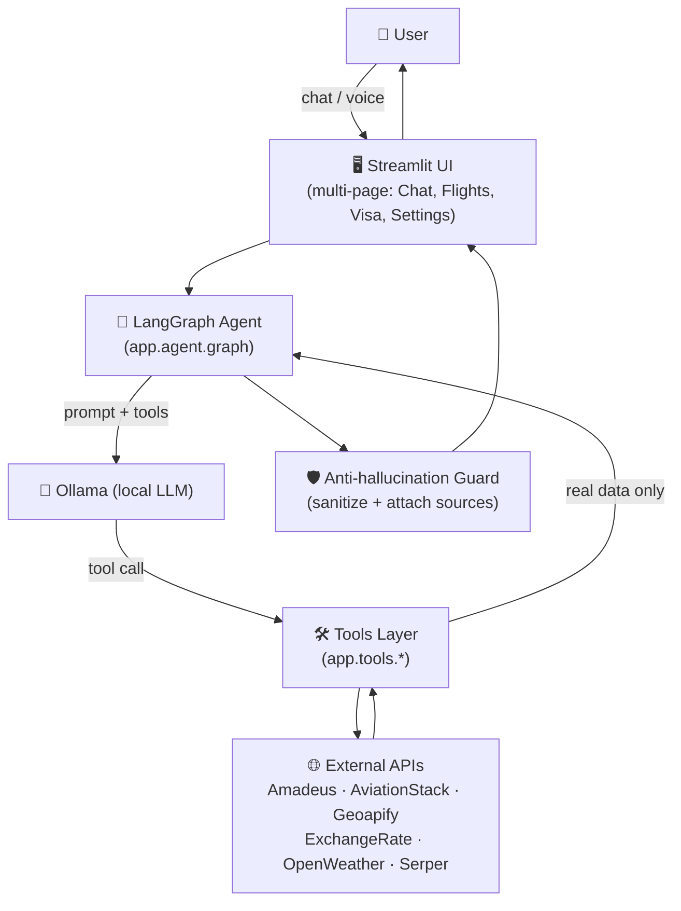

<div align="center">

# ✈️ Avia AI

**An AI-powered travel assistant that searches real flights, compares them, and answers visa/travel questions through natural conversation — powered entirely by a local LLM.**

[](https://www.python.org/)
[](https://streamlit.io/)
[](https://www.langchain.com/langgraph)
[](https://ollama.com/)
[](https://github.com/SYSTRAN/faster-whisper)
[](./tests)
[](./LICENSE)

</div>

---

> **Status: 🟢 Active** — core features implemented and manually verified end-to-end. See [Roadmap](#-roadmap--limitations) for what's next.

## 📖 Table of Contents

- [Demo](#-demo)
- [Why this project](#-why-this-project)
- [Features](#-features)
- [Architecture](#-architecture)
- [Project Structure](#-project-structure)
- [Tech Stack](#-tech-stack)
- [Installation](#-installation)
- [Environment Variables](#-environment-variables)
- [Running Locally](#-running-locally)
- [Example Usage](#-example-usage)
- [Internal Tool API](#-internal-tool-api)
- [Roadmap & Limitations](#-roadmap--limitations)
- [Contributing](#-contributing)
- [License](#-license)
- [Contact](#-contact)

---

## 🎬 Demo

``

<sub>*(record a short screen capture of a chat → flight search → visa lookup flow and drop it in `docs/assets/demo.gif`)*</sub>

<details>
<summary>📸 Screenshots</summary>

| Home | Reys natijalari | Viza xizmati |
|---|---|---|
| `docs/assets/screenshot-home.png` | `docs/assets/screenshot-flights.png` | `docs/assets/screenshot-visa.png` |

</details>

---

## 🧭 Why this project

Cloud LLM APIs (OpenAI, Anthropic, Gemini) are **intentionally not used** —
every response is generated by a model running locally through
[Ollama](https://ollama.com). The hardest constraint the project holds
itself to: **the LLM is never allowed to invent a flight, a price, or a
date.** It only decides *which* tool to call; every fact shown to the user
comes from a real API response. When the model still tries to narrate a
plausible-looking price the active provider didn't supply, a runtime guard
(`app/agent/nodes.py::_sanitize_final_answer`) catches it and swaps in the
real tool output before the user ever sees it — see
[`tests/test_guardrail.py`](tests/test_guardrail.py) for the regression
tests that lock this behavior in.

## ✨ Features

| | | |
|---|---|---|
| ✈️ **Flight Search** | Real flight legs between two IATA airports/cities on a given date, with natural-language filters (time of day, stops, airline, sort order) | `app/tools/flight_search.py` |
| 📊 **Flight Comparison** | Sortable, filterable table of price, duration, stops, and airline for the last search | `app/ui/pages/flights_page.py` |
| 📍 **Airport Search** | Resolve a city to nearby airports, or an IATA code to its airport/city/country | `app/tools/airport.py` (Geoapify) |
| 🛂 **Visa Service** | Requirements, documents, embassy info, processing time/cost, passport & photo rules, application steps, advisories — all live-sourced with citations | `app/ui/pages/visa_page.py` |
| 💰 **Currency Conversion** | Convert a flight's price, or any amount, using a live exchange rate | `app/tools/currency.py` |
| 🛫 **Flight Status** | Live/scheduled status for a specific flight number | `app/tools/flight_status.py` |
| 🌦 **Destination Weather** | Current weather for a destination city | `app/tools/weather.py` |
| 🌍 **Web Search** | General travel questions outside the other tools' domain (safety, city guides), always with a real source link | `app/tools/web_search.py` |
| 🎙️ **Voice Input** | Record a question; transcribed **locally** with Whisper before reaching the agent | `app/utils/speech.py` |
| 💬 **Multi-turn Memory** | "faqat Uzbekistan Airways ko'rsat" / "eng arzonini tanla" resolve against the previous result, no need to repeat yourself | `app/agent/memory.py` |
| 🛡️ **Anti-hallucination Guard** | Catches and corrects a fabricated price/fact before it reaches the user | `app/agent/nodes.py` |
| ⚡ **Fast, tool-scoped responses** | The LLM only reasons about *which* tool to call — no free-form fact generation | `app/agent/graph.py` |

## 🏗 Architecture



**Flow:** a user message (typed or voice, transcribed locally) enters the
LangGraph `StateGraph`. The `agent` node calls Ollama with the tool
definitions bound; if the model requests a tool, the `tools` node executes
it against a real external API and the result loops back to `agent` —
repeating until the model answers without another tool call. Before that
answer reaches the UI, a guard step verifies it against the tool output it
was supposedly built from.

## 📁 Project Structure

```
avia_ai/
├── app/
│   ├── agent/            # LangGraph state, memory, prompts, planner, router, nodes, graph
│   │   ├── graph.py        # compiled StateGraph (agent ⇄ tools loop)
│   │   ├── nodes.py         # LLM call node + anti-hallucination guard
│   │   ├── memory.py        # short-term memory (last search result)
│   │   └── prompts.py        # system prompt templates
│   ├── tools/              # LangChain @tool-decorated callables the LLM can invoke
│   ├── api/                # Network I/O layer — one client per provider + Pydantic schemas
│   ├── utils/               # logger, TTL cache, validators, formatter, local speech-to-text
│   ├── ui/
│   │   ├── components/       # sidebar, topbar, chat, cards, visa, notifications...
│   │   ├── pages/              # Chat / Flight Results / Comparison / Visa / Settings
│   │   ├── theme.py, styles.py # design tokens + injected CSS
│   └── config.py            # centralized Pydantic Settings (env-driven)
├── tests/                  # pytest unit tests
├── docs/                   # architecture, tool API, deployment, dev guide
├── .github/                # CI workflow + issue/PR templates
├── .streamlit/config.toml
├── .env.example
├── requirements.txt
└── main.py                 # entry point — streamlit run main.py
```

## 🧰 Tech Stack


External APIs: **Amadeus** · **AviationStack** · **Geoapify** · **ExchangeRate-API** · **OpenWeatherMap** · **Serper (Google Search)** · **Whisper (local)**

## 📦 Installation

```bash
git clone https://github.com/<your-username>/avia-ai.git
cd avia-ai
python -m venv .venv && source .venv/bin/activate
pip install -r requirements.txt
cp .env.example .env   # then fill in your provider keys
```

### Ollama setup (required — the local LLM)

```bash
brew install ollama          # or see https://ollama.com/download
ollama serve
ollama pull llama3.2:3b      # or qwen2.5:3b-instruct / qwen2.5:7b-instruct
```

Set `OLLAMA_MODEL` in `.env` to whatever you pulled.

## 🔑 Environment Variables

All variables live in `.env` (copy from `.env.example`). Nothing is
hardcoded — see `app/config.py` for the full typed schema.

```bash
# Local LLM
OLLAMA_BASE_URL=http://localhost:11434
OLLAMA_MODEL=llama3.2:3b

# Local speech-to-text
WHISPER_MODEL_SIZE=small
WHISPER_LANGUAGE=uz

# Flight data (pick one provider)
FLIGHT_DATA_PROVIDER=aviationstack      # amadeus | aviationstack | kiwi
AMADEUS_API_KEY=
AMADEUS_API_SECRET=
AVIATIONSTACK_API_KEY=

# Airport search
GEOAPIFY_API_KEY=

# Bonus features
EXCHANGE_RATE_API_KEY=
OPENWEATHER_API_KEY=
SERPER_API_KEY=
```

<details>
<summary>Full variable reference</summary>

| Variable | Purpose |
|---|---|
| `OLLAMA_BASE_URL` / `OLLAMA_MODEL` / `OLLAMA_TEMPERATURE` | Local LLM connection + generation settings |
| `WHISPER_MODEL_SIZE` / `WHISPER_LANGUAGE` | Local speech-to-text model size and pinned language |
| `FLIGHT_DATA_PROVIDER` | `amadeus` \| `aviationstack` \| `kiwi` (selects the active flight client) |
| `AMADEUS_API_KEY` / `AMADEUS_API_SECRET` | Amadeus self-service test API (returns real prices) |
| `AVIATIONSTACK_API_KEY` | AviationStack (real schedules; free tier has no price data) |
| `GEOAPIFY_API_KEY` | Airport/city geocoding + search |
| `EXCHANGE_RATE_API_KEY` | Live currency conversion |
| `OPENWEATHER_API_KEY` | Destination weather |
| `SERPER_API_KEY` | Google Search — visa info, travel advisories |
| `CACHE_TTL_SECONDS` / `CACHE_MAX_ENTRIES` | TTL cache tuning for API responses |
| `HTTP_MAX_RETRIES` / `HTTP_BACKOFF_SECONDS` / `HTTP_TIMEOUT_SECONDS` | Retry/backoff policy for outbound HTTP calls |

</details>

## ▶️ Running Locally

```bash
ollama serve                 # in one terminal, if not already running
streamlit run main.py        # in another
```

Open the URL Streamlit prints (typically `http://localhost:8501`).

**Run the tests:**

```bash
pytest -q
```

**Or with Docker** (Ollama still needs to run on the host — see [`docs/DEPLOYMENT.md`](docs/DEPLOYMENT.md)):

```bash
docker build -t avia-ai .
docker run -p 8501:8501 --env-file .env avia-ai
```

## 💬 Example Usage

```
Siz:  Toshkentdan Istanbulga eng arzon reys top
Avia AI:  [search_flights chaqiriladi → real natijalar jadvali]

Siz:  Faqat Turkish Airlines reyslarini ko'rsat
Avia AI:  [oldingi natijadan filtrlaydi, qayta qidirmaydi]

Siz:  O'zbekiston fuqarolari uchun Turkiyaga viza kerakmi?
Avia AI:  [web_search chaqiriladi → javob + haqiqiy manba havolalari]
```

## 🔌 Internal Tool API

This is a Streamlit app, not a REST service — there's no HTTP endpoint to
call from the outside. The real "API surface" is the set of LangChain
`@tool`-decorated functions the LLM can invoke. Every tool's signature,
arguments, and an example call/response are documented in
[`docs/TOOLS.md`](docs/TOOLS.md).

## 🗺 Roadmap & Limitations

**Known limitations**

- **AviationStack free tier** never returns a price (on any plan), and its
  date filter is paid-only — this app works around that by fetching the
  current schedule and filtering client-side, so it favors near-term dates.
- **Amadeus** does return real prices but needs a free key from
  [developers.amadeus.com](https://developers.amadeus.com).
- Recorded voice/attached files are accepted natively by the chat input,
  but file *content* analysis isn't wired up yet — only audio transcription is.

**Roadmap**

- [ ] Kiwi Tequila as a third `FLIGHT_DATA_PROVIDER`
- [ ] PDF/CSV itinerary export
- [ ] Persist conversation memory to disk/Postgres (currently in-process `MemorySaver`)
- [ ] Document/ticket image analysis for chat-attached files

## 🤝 Contributing

Contributions are welcome — see [`CONTRIBUTING.md`](CONTRIBUTING.md) for
the workflow, and [`CODE_OF_CONDUCT.md`](CODE_OF_CONDUCT.md) for community
guidelines. Please check [`SECURITY.md`](SECURITY.md) before reporting a
vulnerability.

## 📄 License

MIT — see [`LICENSE`](LICENSE).

## 📬 Contact

Questions or feedback? Open an [issue](../../issues) or reach out at
**abduroshyd@gmail.com**.
