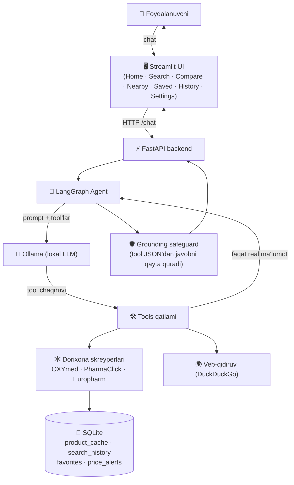

<div align="center">

# AI Pharmacy 💊

**O'zbekiston internet dorixonalari bo'yicha AI yordamida dori qidirish va narx taqqoslash — to'liq lokal LLM asosida ishlaydi, tibbiy maslahat bermaydi.**

[](https://www.python.org/)
[](https://fastapi.tiangolo.com/)
[](https://streamlit.io/)
[](https://www.langchain.com/langgraph)
[](https://ollama.com/)
[](./LICENSE)

</div>

---

> 🟢 **Holati: Faol** — asosiy funksiyalar tayyor va qo'lda sinovdan o'tkazilgan. Keyingi rejalar uchun [Roadmap](#-roadmap) bo'limiga qarang.

## 📖 Mundarija

[Demo](#-demo) · [Skrinshotlar](#-skrinshotlar) · [Nega bu loyiha](#-nega-bu-loyiha) · [Funksiyalar](#-funksiyalar) · [Arxitektura](#-arxitektura) · [AI qanday ishlaydi](#-ai-qanday-ishlaydi) · [Texnologiyalar](#-texnologiyalar) · [Loyiha tuzilishi](#-loyiha-tuzilishi) · [O'rnatish](#-ornatish) · [Muhit o'zgaruvchilari](#-muhit-ozgaruvchilari) · [Ishga tushirish](#-ishga-tushirish) · [Roadmap](#-roadmap) · [Litsenziya](#-litsenziya) · [Muallif](#-muallif)

---

## 🎬 Demo

<div align="center">


</div>

<sub>Joy egallovchi (placeholder) — `docs/assets/demo.gif`. Ko'rsatiladigan oqim: Bosh sahifa (hero + chat) → 3 ta jonli dorixonadan tabiiy tilda qidiruv → eng arzon/eng yaxshi tanlov belgili mahsulot kartalari → Compare Prices jadvali.</sub>

## 🖼 Skrinshotlar

| Bosh sahifa | Qidiruv |
|---|---|
| `docs/assets/screenshot-home.png` | `docs/assets/screenshot-search.png` |

| Natijalar | Taqqoslash |
|---|---|
| `docs/assets/screenshot-results.png` | `docs/assets/screenshot-compare.png` |

## 🧭 Nega bu loyiha

Bir xil dorining narxi O'zbekistondagi har bir internet dorixonasida boshqacha, va hech kim har bir saytni qo'lda tekshirmasdan turib eng arzonini ko'rsatib bermaydi. AI Pharmacy buni suhbat orqali ishlaydigan agent bilan hal qiladi — lekin ko'pchilik "AI health" demolaridan farqli o'laroq, qat'iy chegara qo'yadi: **tashxis qo'ymaydi, davolash usulini tavsiya qilmaydi va nima qabul qilish kerakligini hal qilmaydi.** Faqat xarid qarorida — narx, brend, doza, do'kon — yordam beradi.

Ikkinchi qat'iy qoida: LLM hech qachon mahsulot nomi yoki narxini **o'ylab topmaydi**. U faqat *qaysi tool'ni chaqirishni* hal qiladi; har bir fakt jonli skreyplashdan keladi. Kichik lokal model baribir tool natijasini noto'g'ri qayta hikoya qilib qo'ysa ham, kod darajasidagi **grounding safeguard** (`app/agent/graph.py`) modelning matnini rad etib, javobni tool'ning xom JSON natijasidan deterministik tarzda qayta quradi.

## ✨ Funksiyalar

<table>
<tr>
<td width="33%">

**💊 AI dori qidiruv**
Tabiiy tilda so'rov — bir vaqtning o'zida 3 ta real dorixonadan.

</td>
<td width="33%">

**💰 Narx taqqoslash**
Eng arzon va eng yaxshi tanlov (narx/qadoq) belgili jadval.

</td>
<td width="33%">

**🏥 Dorixonalarni solishtirish**
OXYmed · PharmaClick · Europharm — parallel qidiriladi.

</td>
</tr>
<tr>
<td width="33%">

**🗣️ Tabiiy tildagi qidiruv**
"100 ming so'mgacha Omega-3" — filtr UI kerak emas, shunchaki ishlaydi.

</td>
<td width="33%">

**⚡ Tez qidiruv**
15 daqiqalik SQLite kesh — takroriy so'rov jonli skreyplashni chetlab o'tadi.

</td>
<td width="33%">

**📊 Aqlli tahlil**
Avtomatik xulosa: eng arzon narx, bozor o'rtachasi, tejash foizi.

</td>
</tr>
<tr>
<td width="33%">

**📍 Yaqin dorixonalar**
Ulangan dorixonalar ro'yxati, to'g'ridan-to'g'ri havolalar bilan (soxta geolokatsiyasiz).

</td>
<td width="33%">

**❤️ Saqlangan mahsulotlar**
Bir bosishda sevimlilarga qo'shish, SQLite-backed.

</td>
<td width="33%">

**🛡️ Hallyutsinatsiyaga qarshi himoya**
Har bir javob tool'ning xom natijasidan quriladi, model matniga ishonilmaydi.

</td>
</tr>
</table>

## 🏗 Arxitektura



## 🧠 AI qanday ishlaydi

**Qidiruv jarayoni, qadam-baqadam:**

1. Foydalanuvchi oddiy tilda so'raydi — *"eng arzon Omega-3'ni top"*.
2. Har bir suhbat burilishining birinchi qadamida model **majburiy** tool chaqirishga undaladi (`tool_choice="any"`) — kichik lokal model to'g'ridan-to'g'ri, ehtimol to'qilgan, erkin javobga o'tib keta olmaydi.
3. Tanlangan tool (`search_products_tool`, `filter_products_tool`, `compare_products_tool`, `find_cheapest_tool`, `product_details_tool` yoki `web_search_tool`) haqiqiy dorixona saytiga (yoki 15 daqiqalik keshga) murojaat qilib, real ma'lumot qaytaradi.
4. Yakuniy javob **tool'ning xom JSON natijasidan deterministik tarzda** quriladi — modelning o'zi qayta hikoya qilgan matnidan emas — shunda kichik modelning xulosalash xatolari foydalanuvchiga yetib bormaydi.
5. UI javobni so'z-so'z animatsiya bilan ochadi va qaytgan mahsulotlarni eng arzon/eng yaxshi tanlov belgili kartalar sifatida ko'rsatadi.

## 🧰 Texnologiyalar


| Qatlam | Tanlov |
|---|---|
| Til / runtime | Python 3.12 |
| Agent orkestratsiyasi | LangGraph (tool-chaqiruv sikli + SQLite suhbat xotirasi) |
| LLM | Ollama, lokal — `llama3.2:3b` (bulutli API chaqiruvi yo'q) |
| Backend API | FastAPI |
| Frontend | Streamlit — ko'p sahifali (`st.navigation`), qardosh AI mahsulotlar bilan bir xil dizayn tizimi |
| Ma'lumot yig'ish | BeautifulSoup skreyperlari (3 ta dorixona) + DuckDuckGo veb-qidiruv |
| Kesh / saqlash | SQLite (mahsulot keshi, qidiruv tarixi, sevimlilar, narx signallari) |
| Kod sifati | Ruff (lint + format) |

## 📁 Loyiha tuzilishi

```
ai_pharmacy/
├── app/
│   ├── agent/            # LangGraph state, node'lar (Ollama + tool bind), graph + grounding safeguard
│   ├── tools/             # LLM chaqira oladigan @tool funksiyalar
│   │   └── scrapers/       # OXYmed / PharmaClick / Europharm skreyperlari
│   ├── database/           # SQLite: product_cache, search_history, favorites, price_alerts
│   ├── memory/              # LangGraph SQLite checkpoint (suhbat xotirasi)
│   ├── ui/                  # Streamlit ilova
│   │   ├── theme.py          # rang / radius / soya / shrift dizayn tokenlari
│   │   ├── styles.py          # inject_custom_css() — global CSS
│   │   ├── state.py            # sessiya xotirasi (oxirgi qidiruv, compare ro'yxati)
│   │   ├── utils.py             # backend HTTP klienti, narx/belgi hisob-kitoblari
│   │   ├── assets/                # logo (P + kapsula belgisi, shaffof fon)
│   │   ├── components/             # topbar, sidebar, hero, chat, cards, comparison, animations, notification
│   │   └── pages/                   # Home, Medicine Search, Compare, Nearby, Saved, History, Settings
│   └── config.py           # markazlashgan sozlamalar (.env asosida)
├── docs/                  # skrinshotlar, demo GIF, taqdimot hujjatlari
├── main.py               # FastAPI kirish nuqtasi — python main.py
├── requirements.txt
├── requirements-dev.txt  # lint/format vositalari (ruff)
└── pyproject.toml        # ruff konfiguratsiyasi
```

## 📦 O'rnatish

```bash
git clone https://github.com/hamydullodev/project.git
cd project/ai_pharmacy
python3 -m venv .venv && source .venv/bin/activate
pip install -r requirements.txt
cp .env.example .env
```

### Ollama (majburiy — lokal LLM)

```bash
brew install ollama        # yoki https://ollama.com/download
ollama serve
ollama pull llama3.2:3b     # yoki: ollama pull qwen2.5
```

## 🔑 Muhit o'zgaruvchilari

Hammasi `.env` faylida (`.env.example`dan nusxa oling) — hech narsa kodga qattiq yozilmagan.

```bash
OLLAMA_BASE_URL=http://localhost:11434
OLLAMA_MODEL=llama3.2:3b

DATABASE_PATH=app/database/pharmacy.db
MEMORY_DB_PATH=app/memory/checkpoints.sqlite

API_HOST=0.0.0.0
API_PORT=8020

REQUEST_TIMEOUT=10
```

To'liq ro'yxat: `app/config.py`.

## ▶️ Ishga tushirish

```bash
ollama serve                                                                  # 1-terminal
source .venv/bin/activate && python main.py                                  # 2-terminal — FastAPI, http://localhost:8020
source .venv/bin/activate && streamlit run app/ui/app.py --server.port 8503  # 3-terminal — UI
```

Brauzerda `http://localhost:8503` oching.

> Portlar `.env`dagi `API_PORT` orqali sozlanadi. `8020`/`8503` band bo'lsa, portni o'zgartiring va `--server.port`ni mos ravishda bering.

## 🗺 Roadmap

**Joriy cheklovlar**

- Faqat 3 ta dorixona ulangan; skreyperlar sayt HTML tuzilishiga bog'liq — sayt dizayni o'zgarsa yangilash kerak.
- "Nearby Pharmacies" hozircha jonli masofa/filial joylashuvini ko'rsatmaydi — faqat ulangan dorixonalarning rasmiy saytlariga havola beradi.
- `price_alerts` saqlash qatlami tayyor, lekin uni avtomatik trigger qiluvchi background job hali yo'q.
- Autentifikatsiya yo'q — SQLite bitta jarayonli lokal foydalanish uchun mo'ljallangan.

**Rejalar**

- [ ] Saqlangan narx signallarini avtomatik tekshiruvchi background job
- [ ] 4-chi dorixona (rasmiy API mavjud bo'lsa)
- [ ] Taqqoslash hisobotini PDF qilib eksport qilish
- [ ] Ko'p foydalanuvchili joylashtirish uchun mahsulot keshi/suhbat xotirasini PostgreSQL'ga ko'chirish
- [ ] Skreyperlar uchun unit testlar (HTTP javoblarini mock qilib)

## 📄 Litsenziya

MIT — qarang [`LICENSE`](LICENSE).

## 👤 Muallif

**Jumanov Hamydullo** — [jumanovhamydullo@gmail.com](mailto:jumanovhamydullo@gmail.com)

Lokal-LLM AI agentlar portfoliosining bir qismi — shu repozitoriydagi qardosh **Avia AI** (sayohat qidiruvi) loyihasiga ham qarang.
