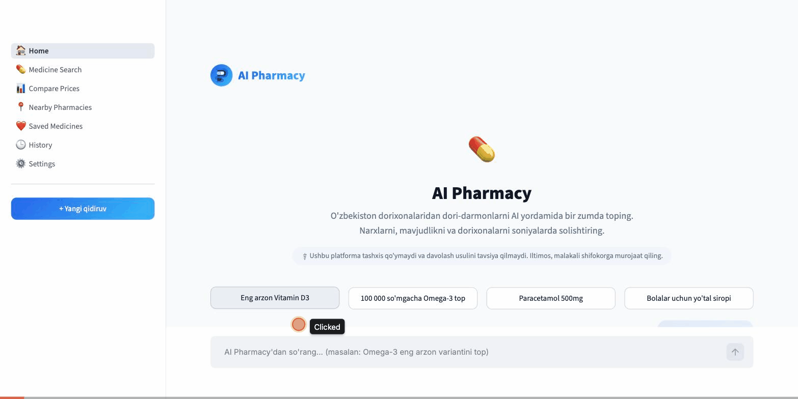
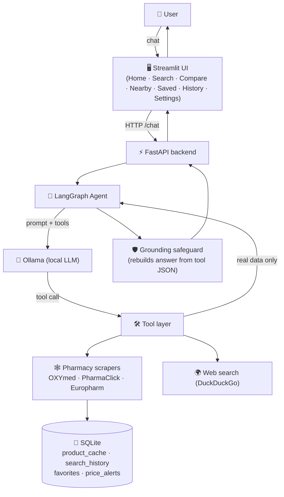

<div align="center">

# AI Pharmacy 💊

**AI-powered medicine search & price comparison across Uzbekistan's online pharmacies — runs on a fully local LLM, never gives medical advice.**

[](https://www.python.org/)
[](https://fastapi.tiangolo.com/)
[](https://streamlit.io/)
[](https://www.langchain.com/langgraph)
[](https://ollama.com/)
[](./LICENSE)

</div>

---

> 🟢 **Status: Active** — core features are built and manually verified end-to-end. See [Roadmap](#-roadmap) for what's next.

## 📖 Contents

[Demo](#-demo) · [Screenshots](#-screenshots) · [Why this project](#-why-this-project) · [Features](#-features) · [Architecture](#-architecture) · [How the AI works](#-how-the-ai-works) · [Tech stack](#-tech-stack) · [Project structure](#-project-structure) · [Installation](#-installation) · [Environment variables](#-environment-variables) · [Run locally](#-run-locally) · [Roadmap](#-roadmap) · [License](#-license) · [Author](#-author)

---

## 🎬 Demo

<div align="center">



</div>

<sub>Placeholder — `docs/assets/demo.gif`. Flow it will show: Home (hero + chat) → natural-language medicine search across 3 live pharmacies → product cards with cheapest/best-value badges → Compare Prices table.</sub>

## 🖼 Screenshots

| Home | Search |
|---|---|
| `docs/assets/screenshot-home.png` | `docs/assets/screenshot-search.png` |

| Results | Comparison |
|---|---|
| `docs/assets/screenshot-results.png` | `docs/assets/screenshot-compare.png` |

## 🧭 Why this project

Prices for the same medicine differ across every Uzbekistan online pharmacy, and nobody shows you the cheapest one without checking each site by hand. AI Pharmacy fixes that with a conversational agent — but it draws a hard line most "AI health" demos don't: **it never diagnoses, never recommends treatment, and never decides what to take.** It only helps with the purchasing decision — price, brand, dosage, store.

The second hard rule: the LLM **never invents** a product name or price. It only decides *which tool to call*; every fact comes from a live scrape. If the small local model still misreports a tool's result, a code-level **grounding safeguard** (`app/agent/graph.py`) discards the model's prose and rebuilds the answer deterministically from the tool's raw JSON.

## ✨ Features

<table>
<tr>
<td width="33%">

**💊 AI Medicine Search**
Natural-language queries across 3 real Uzbekistan pharmacies at once.

</td>
<td width="33%">

**💰 Price Comparison**
Side-by-side table with cheapest & best-value (price/unit) badges.

</td>
<td width="33%">

**🏥 Pharmacy Comparison**
OXYmed · PharmaClick · Europharm, searched in parallel.

</td>
</tr>
<tr>
<td width="33%">

**🗣️ Natural Language Search**
"Omega-3 under 100,000 so'm" just works — no filters UI required.

</td>
<td width="33%">

**⚡ Fast Search**
15-minute SQLite cache means repeat queries skip the live scrape.

</td>
<td width="33%">

**📊 Smart Product Analysis**
Auto-generated summary: cheapest price, market average, % savings.

</td>
</tr>
<tr>
<td width="33%">

**📍 Nearby Pharmacies**
Directory of connected pharmacies with direct links (honest — no fake geolocation).

</td>
<td width="33%">

**❤️ Saved Products**
One-click favorites, backed by SQLite.

</td>
<td width="33%">

**🛡️ Hallucination Guard**
Every answer is rebuilt from raw tool output, never trusted from model prose.

</td>
</tr>
</table>

## 🏗 Architecture



## 🧠 How the AI works

**Search workflow, step by step:**

1. User asks in plain language — *"find the cheapest Omega-3"*.
2. The model is **forced** to call a tool on the first step of every turn (`tool_choice="any"`) — a small local model can't skip straight to a possibly-fabricated free-text answer.
3. The chosen tool (`search_products_tool`, `filter_products_tool`, `compare_products_tool`, `find_cheapest_tool`, `product_details_tool`, or `web_search_tool`) hits a real pharmacy site (or a 15-minute cache) and returns real data.
4. The final answer is rebuilt **deterministically from the tool's raw JSON** — never from the model's own retelling — so a small model's summarization mistakes never reach the user.
5. The UI reveals the answer word-by-word and renders any returned products as cards with cheapest/best-value badges.

## 🧰 Tech Stack


| Layer | Choice |
|---|---|
| Language / runtime | Python 3.12 |
| Agent orchestration | LangGraph (tool-calling loop + SQLite-backed conversation memory) |
| LLM | Ollama, local — `llama3.2:3b` (no cloud API calls) |
| Backend API | FastAPI |
| Frontend | Streamlit — multi-page (`st.navigation`), shared design system with sibling AI products |
| Data acquisition | BeautifulSoup scrapers (3 pharmacies) + DuckDuckGo web search |
| Caching / storage | SQLite (product cache, search history, favorites, price alerts) |
| Code quality | Ruff (lint + format) |

## 📁 Project Structure

```
ai_pharmacy/
├── app/
│   ├── agent/            # LangGraph state, nodes (Ollama + tool binding), graph + grounding safeguard
│   ├── tools/             # @tool functions the LLM can call
│   │   └── scrapers/       # OXYmed / PharmaClick / Europharm scrapers
│   ├── database/           # SQLite: product_cache, search_history, favorites, price_alerts
│   ├── memory/              # LangGraph SQLite checkpoint (conversation memory)
│   ├── ui/                  # Streamlit app
│   │   ├── theme.py          # color / radius / shadow / font design tokens
│   │   ├── styles.py          # inject_custom_css() — global CSS
│   │   ├── state.py            # session memory (last search, compare list)
│   │   ├── utils.py             # backend HTTP client, price/badge logic
│   │   ├── assets/                # logo (P + capsule mark, transparent)
│   │   ├── components/             # topbar, sidebar, hero, chat, cards, comparison, animations, notification
│   │   └── pages/                   # Home, Medicine Search, Compare, Nearby, Saved, History, Settings
│   └── config.py           # centralized settings (.env-driven)
├── docs/                  # screenshots, demo GIF, presentation docs
├── main.py               # FastAPI entry point — python main.py
├── requirements.txt
├── requirements-dev.txt  # lint/format tooling (ruff)
└── pyproject.toml        # ruff config
```

## 📦 Installation

```bash
git clone https://github.com/hamydullodev/project.git
cd project/ai_pharmacy
python3 -m venv .venv && source .venv/bin/activate
pip install -r requirements.txt
cp .env.example .env
```

### Ollama (required — local LLM)

```bash
brew install ollama        # or https://ollama.com/download
ollama serve
ollama pull llama3.2:3b     # or: ollama pull qwen2.5
```

## 🔑 Environment Variables

Everything lives in `.env` (copy from `.env.example`) — nothing is hardcoded.

```bash
OLLAMA_BASE_URL=http://localhost:11434
OLLAMA_MODEL=llama3.2:3b

DATABASE_PATH=app/database/pharmacy.db
MEMORY_DB_PATH=app/memory/checkpoints.sqlite

API_HOST=0.0.0.0
API_PORT=8020

REQUEST_TIMEOUT=10
```

Full list: `app/config.py`.

## ▶️ Run Locally

```bash
ollama serve                                                                  # terminal 1
source .venv/bin/activate && python main.py                                  # terminal 2 — FastAPI, http://localhost:8020
source .venv/bin/activate && streamlit run app/ui/app.py --server.port 8503  # terminal 3 — UI
```

Open `http://localhost:8503` in your browser.

> Ports are configurable via `API_PORT` in `.env`. If `8020`/`8503` are busy, change the port and pass `--server.port` accordingly.

## 🗺 Roadmap

**Current limitations**

- Only 3 pharmacies connected; scrapers depend on site HTML structure and need updates if a site redesigns.
- "Nearby Pharmacies" doesn't show live distance/branch location yet — it links to each connected pharmacy's official site.
- The `price_alerts` storage layer exists, but no background job triggers alerts automatically yet.
- No authentication — SQLite is built for local, single-process use.

**Planned**

- [ ] Background job to auto-check saved price alerts
- [ ] A 4th pharmacy (if an official API becomes available)
- [ ] PDF export for comparison reports
- [ ] Move product cache / conversation memory to PostgreSQL for multi-user deployment
- [ ] Unit tests for scrapers (mocked HTTP responses)

## 📄 License

MIT — see [`LICENSE`](LICENSE).

## 👤 Author

**Abduroshyd** — [abduroshyd@gmail.com](mailto:abduroshyd@gmail.com)

Part of a small portfolio of local-LLM AI agents — see the sibling **Avia AI** (travel search) project in this same repository.
