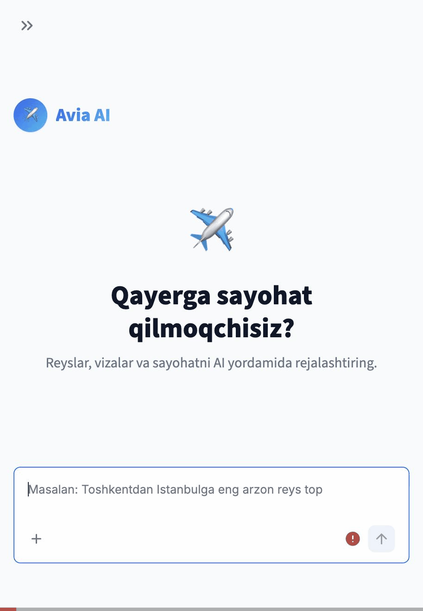
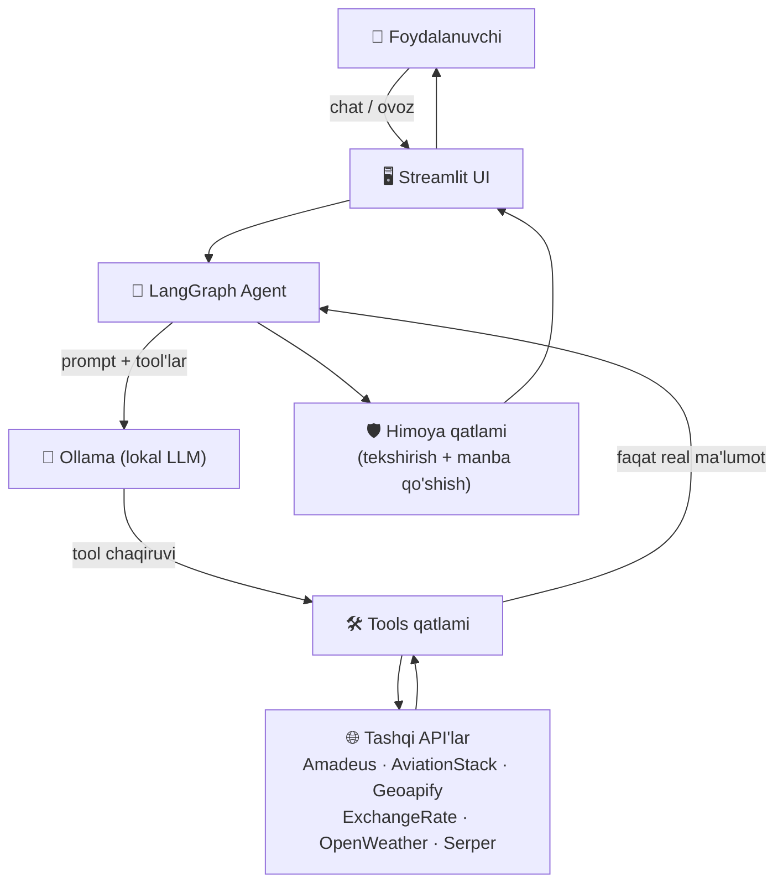

<div align="center">

# ✈️ Avia AI

**Real reyslarni qidiradigan, taqqoslaydigan va viza/sayohat savollariga tabiiy suhbat orqali javob beradigan AI agent — to'liq lokal LLM asosida ishlaydi.**

[](https://www.python.org/)
[](https://streamlit.io/)
[](https://www.langchain.com/langgraph)
[](https://ollama.com/)
[](./tests)
[](./LICENSE)

</div>

---

> **Holati: 🟢 Faol** — asosiy funksiyalar tayyor va sinovdan o'tgan. Qolganlari uchun [Roadmap](#-roadmap--cheklovlar) bo'limiga qarang.

## 📖 Mundarija

[Demo](#-demo) · [Nega bu loyiha](#-nega-bu-loyiha) · [Funksiyalar](#-funksiyalar) · [Arxitektura](#-arxitektura) · [Loyiha tuzilishi](#-loyiha-tuzilishi) · [Texnologiyalar](#-texnologiyalar) · [O'rnatish](#-ornatish) · [Muhit o'zgaruvchilari](#-muhit-ozgaruvchilari) · [Ishga tushirish](#-ishga-tushirish) · [Misol](#-foydalanish-misoli) · [Tool API](#-ichki-tool-api) · [Roadmap](#-roadmap--cheklovlar) · [Litsenziya](#-litsenziya)

---

## 🎬 Demo



<sub>Chat → reys qidiruv (real AviationStack natijalari) → Reys natijalari sahifasi → Viza xizmati (jonli veb-qidiruv, real manba havolalari bilan).</sub>

## 🧭 Nega bu loyiha

Cloud LLM'lar (OpenAI, Gemini va h.k.) **ataylab ishlatilmagan** — barcha javoblar [Ollama](https://ollama.com) orqali lokal ishlaydigan modeldan keladi. Eng qattiq qoida: **LLM hech qachon reys, narx yoki sanani o'zi o'ylab topmaydi** — u faqat qaysi tool'ni chaqirishni hal qiladi, har bir fakt haqiqiy API javobidan keladi. Model baribir mavjud bo'lmagan narxni "to'qib" aytishga urinsa, kod darajasidagi himoya (`app/agent/nodes.py`) buni ushlab, haqiqiy natija bilan almashtiradi — bunga oid testlar: [`tests/test_guardrail.py`](tests/test_guardrail.py).

## ✨ Funksiyalar

| | |
|---|---|
| ✈️ **Reys qidiruv** | IATA aeroportlar orasida real reyslar, tabiiy tildagi filtrlar (vaqt, to'xtash, aviakompaniya) |
| 📊 **Taqqoslash** | Oxirgi qidiruvni narx/vaqt/aviakompaniya bo'yicha saralab-filtrlab ko'rish |
| 📍 **Aeroport qidiruv** | Shahar → yaqin aeroportlar, yoki IATA kod → shahar/davlat (Geoapify) |
| 🛂 **Viza xizmati** | Talablar, hujjatlar, elchixona, muddat/narx, pasport/foto qoidalari — barchasi jonli manba bilan |
| 💰 **Valyuta konvertatsiya** | Jonli kurs bo'yicha istalgan summani o'girish |
| 🛫 **Reys holati** | Muayyan reysning jonli/rejadagi holati |
| 🌦 **Ob-havo** | Manzil shahridagi joriy ob-havo |
| 🌍 **Veb-qidiruv** | Boshqa tool'lar qamrab olmaydigan savollar — doim haqiqiy manba havolasi bilan |
| 🎙️ **Ovozli xabar** | Gapiring — lokal Whisper matnga aylantiradi, agentga shundan keyin ketadi |
| 💬 **Ko'p bosqichli xotira** | "faqat shu aviakompaniya", "eng arzonini tanla" — qayta qidirmasdan oldingi natijadan ishlaydi |
| 🛡️ **Hallyutsinatsiyaga qarshi himoya** | To'qilgan fakt foydalanuvchiga yetib borishdan oldin ushlanadi va tuzatiladi |

## 🏗 Arxitektura



Foydalanuvchi xabari LangGraph siklidan o'tadi: `agent` node Ollama'ni tool'lar bilan chaqiradi → model tool so'rasa, `tools` node haqiqiy API'ga murojaat qiladi → natija yana `agent`ga qaytadi — model tool so'ramay javob berguncha davom etadi. Javob foydalanuvchiga yetishdan oldin himoya qatlami uni tekshiradi.

## 📁 Loyiha tuzilishi

```
avia_ai/
├── app/
│   ├── agent/     # LangGraph state, xotira, promptlar, node'lar, graph
│   ├── tools/     # LLM chaqira oladigan @tool funksiyalar
│   ├── api/       # Tashqi API klientlar + Pydantic sxemalar
│   ├── utils/     # logger, keshlash, validatsiya, formatlash, ovoz-matn
│   ├── ui/        # sahifalar (Chat/Reyslar/Taqqoslash/Viza/Sozlamalar), komponentlar
│   └── config.py  # markazlashgan sozlamalar (.env asosida)
├── tests/         # pytest testlari
├── docs/          # arxitektura, tool API, deploy, dev qo'llanma
├── .github/       # CI + issue/PR shablonlari
└── main.py        # kirish nuqtasi — streamlit run main.py
```

## 🧰 Texnologiyalar


Tashqi API'lar: **Amadeus** · **AviationStack** · **Geoapify** · **ExchangeRate-API** · **OpenWeatherMap** · **Serper** · **Whisper (lokal)**

## 📦 O'rnatish

```bash
git clone https://github.com/<username>/project.git
cd project/avia_ai
python -m venv .venv && source .venv/bin/activate
pip install -r requirements.txt
cp .env.example .env   # keyin o'z API key'laringizni kiriting
```

### Ollama (majburiy — lokal LLM)

```bash
brew install ollama
ollama serve
ollama pull llama3.2:3b
```

## 🔑 Muhit o'zgaruvchilari

Hammasi `.env` faylida (`.env.example`dan nusxa oling), hech narsa kodga qattiq yozilmagan.

```bash
OLLAMA_BASE_URL=http://localhost:11434
OLLAMA_MODEL=llama3.2:3b

WHISPER_MODEL_SIZE=small
WHISPER_LANGUAGE=uz

FLIGHT_DATA_PROVIDER=aviationstack      # amadeus | aviationstack
AMADEUS_API_KEY=
AMADEUS_API_SECRET=
AVIATIONSTACK_API_KEY=

GEOAPIFY_API_KEY=
EXCHANGE_RATE_API_KEY=
OPENWEATHER_API_KEY=
SERPER_API_KEY=
```

To'liq ro'yxat va izohlar: `app/config.py`.

## ▶️ Ishga tushirish

```bash
ollama serve                 # 1-terminal
streamlit run main.py        # 2-terminal
pytest -q                    # testlar
```

**Docker bilan** (Ollama baribir host'da ishlashi kerak — [`docs/DEPLOYMENT.md`](docs/DEPLOYMENT.md)):

```bash
docker build -t avia-ai .
docker run -p 8501:8501 --env-file .env avia-ai
```

## 💬 Foydalanish misoli

```
Siz:      Toshkentdan Istanbulga eng arzon reys top
Avia AI:  [search_flights chaqiriladi → real natijalar]

Siz:      Faqat Turkish Airlines reyslarini ko'rsat
Avia AI:  [oldingi natijadan filtrlaydi, qayta qidirmaydi]

Siz:      O'zbekiston fuqarolari uchun Turkiyaga viza kerakmi?
Avia AI:  [web_search → javob + haqiqiy manba havolalari]
```

## 🔌 Ichki Tool API

Bu Streamlit ilova, REST xizmat emas — tashqaridan chaqiriladigan HTTP endpoint yo'q. Haqiqiy "API" — LLM chaqira oladigan `@tool` funksiyalar. Har birining argumentlari va misoli: [`docs/TOOLS.md`](docs/TOOLS.md).

## 🗺 Roadmap & cheklovlar

**Cheklovlar**

- AviationStack bepul tarifi narx bermaydi va faqat joriy kun jadvalini beradi (kelajakdagi sana uchun cheklangan).
- Amadeus real narx beradi, lekin bepul key kerak: [developers.amadeus.com](https://developers.amadeus.com).
- Chatga biriktirilgan fayl qabul qilinadi, lekin mazmuni hali tahlil qilinmaydi (faqat ovoz matnga aylantiriladi).

**Rejalar**

- [ ] Kiwi Tequila — uchinchi flight provider
- [ ] Marshrutni PDF/CSV qilib eksport qilish
- [ ] Suhbat xotirasini diskka/Postgres'ga saqlash
- [ ] Biriktirilgan fayl/rasm tahlili

## 📄 Litsenziya

MIT — [`LICENSE`](LICENSE).

## 📬 Aloqa

Savol yoki taklif bo'lsa — [issue oching](../../issues) yoki yozing: **abduroshyd@gmail.com**.
