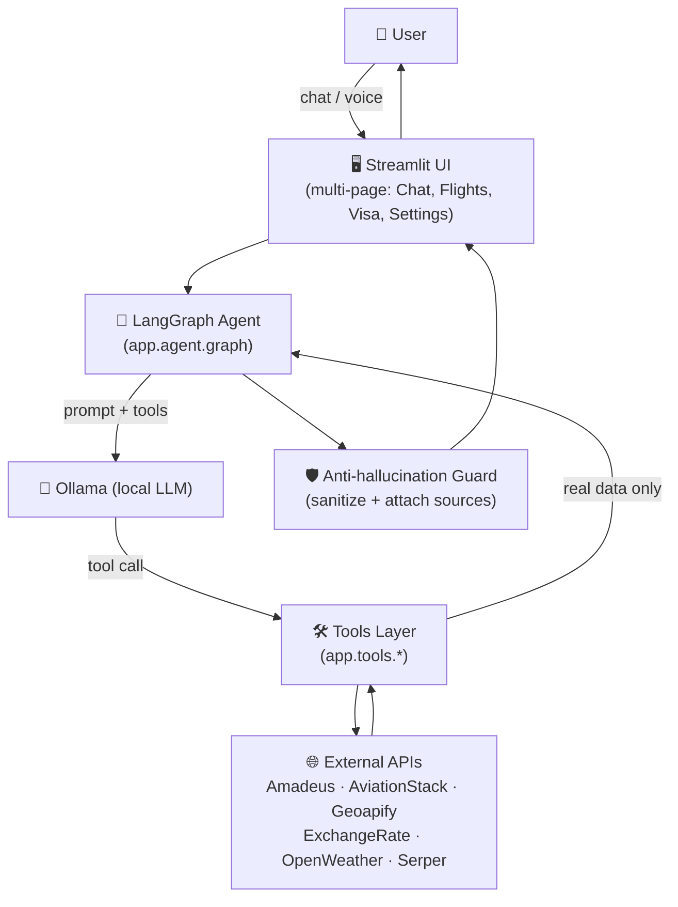

# Architecture

## Overview

## Layers

### `app/agent` — orchestration

- **`state.py`** — the LangGraph `AgentState`: a single `messages` channel
  (LangGraph's `add_messages` reducer), checkpointed per browser session
  via `MemorySaver` so a page reload doesn't lose the conversation.
- **`graph.py`** — builds the `StateGraph`: an `agent` node (calls the LLM
  with tools bound) and a `tools` node (LangGraph's `ToolNode`), looping
  until the model answers without requesting another tool.
- **`nodes.py`** — the `agent` node's implementation, plus two guards that
  run on every final answer before it's returned:
  - `_sanitize_final_answer` — if the model narrates a price/amount the
    active tool explicitly reported as unavailable, the answer is replaced
    with the real (price-less) tool output.
  - `_append_sources` — if the answer relied on `web_search` or
    `recommend_destination_guide` but dropped the source URL, the real
    link(s) are appended.
- **`memory.py`** — a process-wide `ConversationMemory` holding the most
  recent search query/results, so follow-ups ("faqat shu aviakompaniya",
  "eng arzonini tanla") and the Flight Results/Comparison pages can reuse
  it without re-querying a provider.
- **`prompts.py`** — the system prompt, rendered fresh each turn with
  today's date so a small local model doesn't guess the wrong year for a
  date like "15-avgust".
- **`planner.py`** — resolves relative date words ("bugun", "ertaga") to
  absolute ISO dates before the prompt reaches the model.

### `app/tools` — what the LLM can do

Thin, `@tool`-decorated wrappers. Each one validates arguments, delegates
data retrieval to `app/api`, and returns a formatted string — never a
number the tool itself invented. Full reference: [`TOOLS.md`](TOOLS.md).

### `app/api` — the only layer allowed to do network I/O

One client per external provider (`amadeus.py`, `aviationstack.py`,
`geoapify.py`, `exchange_rate.py`, `openweather.py`, `serper.py`), a
shared `exceptions.py` hierarchy (`AuthenticationError`, `RateLimitError`,
`NoResultsError`, ...) so tools can turn a failure into a friendly message
instead of a stack trace, and `schemas.py` (`Flight`, `Airport`,
`CurrencyRate`, `WeatherInfo`, `WebSearchResult`) as the shapes crossing
the boundary into the rest of the app. `provider.py` dispatches to
whichever `FLIGHT_DATA_PROVIDER` is configured.

### `app/ui` — Streamlit presentation layer

- **`pages/`** — one file per page (`st.Page`), wired together by
  `st.navigation` in `main.py`: Chat, Reys natijalari (flight results),
  Taqqoslash (comparison), Viza xizmati, Sozlamalar (settings).
- **`components/`** — reusable pieces: `chat.py` (bubbles, streaming
  reveal, native file/voice input), `cards.py` (flight cards), `visa.py`
  (visa info cards), `sidebar.py`, `topbar.py`, `notification.py`.
- **`theme.py` / `styles.py`** — design tokens and the injected CSS; the
  light/dark toggle works by re-emitting the CSS with different color
  values from `st.session_state`, not client-side JS.

### `app/utils`

`logger.py` (loguru setup), `cache.py` (TTL cache decorator for API
responses), `validators.py` (IATA/date/currency validation), `formatter.py`
(tables/markdown rendering), `speech.py` (local Whisper transcription).

## Why a local LLM only decides, never invents

The PDF specification this project was originally built against has one
non-negotiable rule: the LLM must never invent a flight, price, or date —
every fact has to come from a real API call. A 3B-parameter local model is
not reliable enough to always honor that instruction on its own (see
`tests/test_guardrail.py` for a reproduced case where it fabricated a
price after the tool explicitly said none was available), so the
guarantee is enforced in code, not just in the system prompt.
