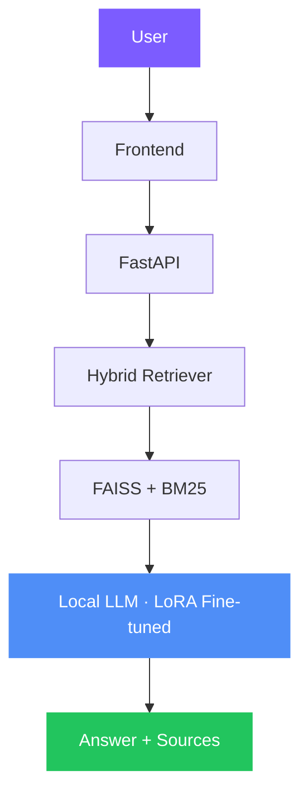

<div align="center">

# ⚖️ UzLaw AI

Local, cited, hybrid-RAG legal assistant for Uzbekistan's legal codes.

<br/>


<a href="LICENSE"></a>

</div>

---

## Features

⚖️ Legal Question Answering
📄 Hybrid RAG
🔍 Semantic Search
🧠 Local LLM
📚 Source Citation
🚀 Fast Retrieval

---

## Tech Stack


---

## Project Structure

```
hybrid_rag/
├── app/            # RAG core: ingestion, retriever, reranker, llm
├── api/            # FastAPI backend (SSE streaming)
├── frontend/       # Next.js product UI
├── docs/           # Architecture & evaluation docs
└── tests/          # Pipeline & retrieval-quality tests
```

---

## Architecture



---

## Demo

<div align="center">

</div>

---

## How it Works

1. User asks
2. Hybrid Retrieval
3. Re-ranking
4. Local LLM generates
5. Sources returned

---

## Fine-Tuning

Fine-tuned using **LoRA**.

- **Base Model:** Llama 3.2 / Qwen 2.5
- **Dataset:** Alpaca-format instruction data
- **Unsloth** for efficient training
- **PEFT** + **LoRA** adapters
- **Hugging Face Transformers** + **PyTorch**

---

## Results

| Metric | Value |
|---|---|
| Retrieval Accuracy (nDCG@5) | 0.77 |
| Latency | Local, hardware-dependent |
| Context Length | 128K (Llama 3.2) |

---

## License

MIT

