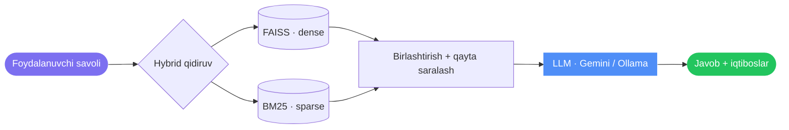

<div align="center">


<br/>

<a href="#-tezkor-boshlash"></a>
<a href="docs/"></a>
<a href="https://github.com/hamydullodev/project/tree/main/hybrid_rag"></a>

<br/><br/>


<a href="LICENSE"></a>

</div>

<br/>

## 🎯 Loyiha nima qiladi

**UzLaw AI** — Oʻzbekiston Respublikasi qonun hujjatlari asosida savollarga
javob beruvchi sunʼiy intellekt yordamchisi. Javoblar hech qachon
oʻylab topilmaydi — har biri qidiruv orqali topilgan haqiqiy modda
matniga asoslanadi va aynan qaysi qonun, qaysi moddadan olinganini
koʻrsatadi.

- 🏛 **68 ta qonun hujjati** — 18 kodeks, 49 qonun va Konstitutsiya, yagona
  qidiruv tizimida (yangi qonun qoʻshish uchun shunchaki papka yaratish kifoya)
- 🔍 **Hybrid qidiruv** — FAISS (maʼno boʻyicha) + BM25 (aniq atama boʻyicha),
  natijalar birlashtirilib, cross-encoder orqali qayta saralanadi
- 🧭 **Kolleksiya boʻyicha qidiruv** — bitta kodeks ichida yoki bir nechta
  qonun boʻylab (masalan, Oila kodeksi + Vasiylik qonuni) birgalikda qidirish
- 📄 **Hujjat yuklab tahlil qilish** — PDF/DOCX/TXT/skanerlangan rasmni
  yuklang, sunʼiy intellekt xulosa, huquq-majburiyatlar, muddatlar va
  ehtimoliy oqibatlarni ajratib beradi
- 🤖 **Ikki LLM provayder** — toʻliq lokal (Ollama) yoki bulutli (Gemini),
  `.env` faylda bir qatorda almashtiriladi
- 📖 **Har doim iqtibos bilan** — javobda aniq qonun nomi va modda raqami
  koʻrsatiladi; topilmasa, shunday deb ochiq aytiladi

<br/>

## 🧱 Texnologiyalar

<div align="center">


</div>

| Qatlam | Tanlov |
|---|---|
| **Frontend** | Next.js · TypeScript · Tailwind CSS · Framer Motion |
| **Backend** | FastAPI, Server-Sent Events orqali striming javoblar |
| **Qidiruv** | FAISS (dense) + BM25 (sparse), cross-encoder bilan qayta saralanadi |
| **LLM** | Gemini (bulutli) yoki [Ollama](https://ollama.com) (toʻliq lokal) — `.env`da tanlanadi |
| **Maʼlumotlar bazasi** | SQLite (hujjat/boʻlak metama'lumotlari) + FAISS/BM25 indekslari |
| **Ichki vosita** | Streamlit (indeks boshqaruvi, qidiruv diagnostikasi, statistika) |

<br/>

## 🏗️ Arxitektura



Toʻliq tafsilotlar (so'rov ketma-ketligi, modul chegaralari, API shartnomasi):
[`docs/architecture.md`](docs/architecture.md).

<br/>

## ⚙️ Qanday ishlaydi

| Qadam | Nima boʻladi |
|:---:|---|
| 1️⃣ | Savol FAISS (maʼno boʻyicha) va BM25 (aniq atama boʻyicha) orqali qidiriladi — ixtiyoriy ravishda bitta yoki bir nechta kolleksiya bilan cheklanadi |
| 2️⃣ | Ikkala natija birlashtiriladi, cross-encoder qayta saralaydi |
| 3️⃣ | Eng mos manbalar tanlangan LLM (Gemini yoki Ollama)ga uzatiladi |
| 4️⃣ | Javob faqat manbalarga asoslanib, iqtibos bilan striming tarzida qaytariladi |

Hujjat yuklab tahlil qilishda esa retrieval bosqichi ishtirok etmaydi —
faqat yuklangan hujjatning oʻz matni tahlil qilinadi, shu bois "tegishli
qonunlar" boʻlimi faqat hujjatning oʻzida zikr etilgan qonunlarni
koʻrsatadi, oʻylab topilmagan.

<br/>

## 🎬 Demo

<div align="center">

</div>

<br/>

## 🚀 Tezkor boshlash

```bash
# Backend
cd hybrid_rag && python3 -m venv .venv && source .venv/bin/activate
pip install -r requirements.txt
cp .env.example .env
python run_api.py                   # http://localhost:8000

# Frontend (alohida terminalda)
cd frontend && npm install && cp .env.local.example .env.local
npm run dev                         # http://localhost:3000

# Lokal LLM ishlatmoqchi bo'lsangiz (alohida terminalda)
ollama pull llama3.2:3b && ollama serve
# Yoki .env faylda LLM_PROVIDER=gemini va GEMINI_API_KEY qo'ying
```

Birinchi ishga tushirishda indeks qurish kerak — qarang
[`docs/deployment.md`](docs/deployment.md). To'liq sozlash, konfiguratsiya
ma'lumotnomasi va Streamlit diagnostika vositasi: [`docs/`](docs/).

<br/>

## 💬 Namuna so'rovlar

- *"Mehnat shartnomasini ish beruvchi qanday bekor qiladi?"*
- *"Jinoyat javobgarligi yoshi nechchidan boshlanadi?"*
- *"Vasiylik va homiylik qanday rasmiylashtiriladi?"*
- *"Oila kodeksi haqida umumiy ma'lumot bering"* — bir nechta kolleksiya
  bo'ylab qidiruv
- 📎 Ijara shartnomangizni yuklang — "+" tugmasi orqali huquq, majburiyat
  va muddatlarni avtomatik tahlil qildiring

<br/>

## 📂 Loyiha tuzilishi

```
hybrid_rag/
├── app/                  # RAG yadrosi — ilova-freymvorkdan mustaqil
│   ├── config/           #   sozlamalar + kolleksiya (qonun) identifikatsiyasi
│   ├── database/         #   SQLite sxemasi va repozitoriy
│   ├── ingestion/        #   hujjat yuklash, tozalash, bo'laklash
│   ├── retriever/        #   FAISS, BM25, hybrid qidiruv
│   ├── reranker/         #   cross-encoder qayta saralash
│   ├── rag/               #   so'rovni qayta ishlash, RAG quvuri
│   ├── llm/               #   Ollama va Gemini provayderlari
│   ├── prompts/           #   LLM uchun prompt shablonlari
│   └── ui/                #   Streamlit ichki vosita
├── api/                  # FastAPI HTTP qatlami (Next.js frontend uchun)
│   └── routers/           #   /ask, /analyze-document, /collections, /health
├── frontend/              # Next.js mahsulot interfeysi
├── tests/                # pytest test to'plami
├── docs/                 # arxitektura, joylashtirish, baholash hujjatlari
└── data/, indexes/         # SQLite maʼlumotlar bazasi va FAISS/BM25 indekslari
```

<br/>

## 📚 Hujjatlar

[Arxitektura](docs/architecture.md) ·
[Hybrid qidiruv](docs/hybrid-retrieval.md) ·
[Baholash](docs/evaluation.md) ·
[Konfiguratsiya](docs/configuration.md) ·
[Joylashtirish](docs/deployment.md)

<br/>

## 🔭 Kelajakdagi rejalar

- 🧭 Fuqarolarga bosqichma-bosqich yo'l-yo'riq (masalan, "farzand asrab
  olish qanday amalga oshiriladi")
- 🔗 Hujjat tahlilini indekslangan korpus bilan bog'lash (tasdiqlangan
  "tegishli moddalar" tavsiyasi)
- 🌐 Sinonim kengaytirish va so'rovni tushunishni yaxshilash
- 📊 Har bir javob uchun ishonch balli va ko'rsatkichlari

<br/>

## 📄 Litsenziya

MIT — qarang [`LICENSE`](LICENSE).

> [!IMPORTANT]
> Kiritilgan qonun matnlari Oʻzbekiston Respublikasining ochiq qonun
> hujjatlaridir. Har qanday haqiqiy huquqiy qaror qabul qilishdan oldin
> rasmiy manba ([lex.uz](https://lex.uz)) bilan solishtirib tekshiring —
> bu ta'lim maqsadidagi qidiruv tizimi, yuridik maslahat emas.

<br/>

<div align="center">
<sub>⚖️ UzLaw AI · Oʻzbekiston uchun sunʼiy intellekt asosidagi yuridik yordamchi</sub>
</div>
