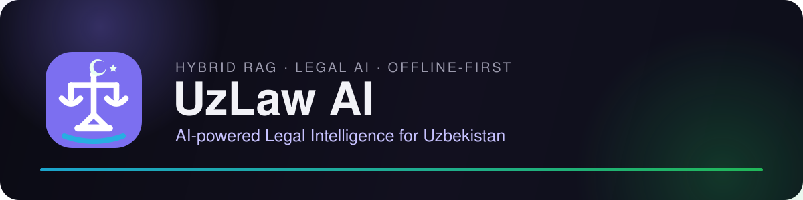
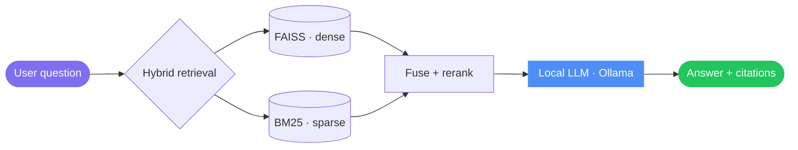
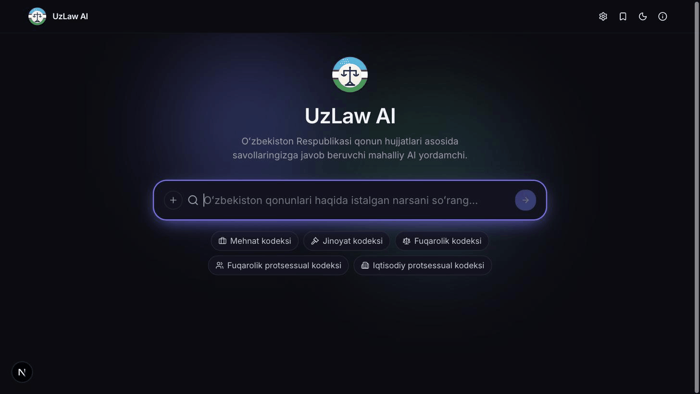

<div align="center">



<br/>

<a href="#quick-start"></a>
<a href="docs/"></a>
<a href="https://github.com/hamydullodev/project/tree/main/hybrid_rag"></a>

<br/><br/>


<a href="LICENSE"></a>

</div>

<br/>

## 🎯 What it does

**UzLaw AI** answers legal questions in Uzbek, grounded in the actual
text of Uzbekistan's legal codes — hybrid retrieval (FAISS + BM25) finds
the right articles, a reranker verifies relevance, and a local LLM
answers *only* from what was retrieved. Fully offline after setup, no
cloud APIs, every answer cited and expandable back to source.

<br/>

## ✨ Features

- ⚖️ Legal question answering, in Uzbek
- 📄 Hybrid RAG (dense + sparse retrieval)
- 🔍 Semantic search over Uzbekistan's legal codes
- 🧠 Local LLM — fully offline, no cloud API calls
- 📚 Inline, expandable source citations
- 🚀 Cross-encoder reranking for relevance
- 🖥️ Streamlit tool for index management & retrieval debugging

<br/>

## 🧱 Tools used

<div align="center">


</div>

| Layer | Choice |
|---|---|
| **Frontend** | Next.js · TypeScript · Tailwind CSS · Framer Motion |
| **Backend** | FastAPI, streaming answers over Server-Sent Events |
| **Retrieval** | FAISS (dense) + BM25 (sparse), fused and reranked by a cross-encoder |
| **LLM** | Local, via [Ollama](https://ollama.com) — no cloud API calls |
| **Internal tool** | Streamlit (index management, retrieval debug, stats) |

<br/>

## 📁 Project structure

```
hybrid_rag/
├── app/               # Framework-agnostic RAG core
│   ├── ingestion/     # Document parsing & chunking
│   ├── retriever/     # FAISS (dense) + BM25 (sparse)
│   ├── reranker/      # Cross-encoder relevance scoring
│   ├── llm/            # Ollama client + prompting
│   └── ui/             # Streamlit internal tool
├── api/                # FastAPI backend (streams /api/ask over SSE)
├── frontend/           # Next.js product UI
├── docs/                # Architecture, retrieval, evaluation, deployment
└── tests/               # Pipeline, retrieval-quality & API tests
```

<br/>

## 🏗️ Architecture



Full breakdown (request sequence, module boundaries, API contract):
[`docs/architecture.md`](docs/architecture.md).

<br/>

## ⚙️ Qanday ishlaydi

| Qadam | Nima boʻladi |
|:---:|---|
| 1️⃣ | Savol FAISS (maʼno boʻyicha) va BM25 (aniq atama boʻyicha) orqali qidiriladi |
| 2️⃣ | Ikkala natija birlashtiriladi, cross-encoder qayta saralaydi |
| 3️⃣ | Eng mos manbalar mahalliy LLM (Ollama)ga uzatiladi |
| 4️⃣ | Javob manbalarga asoslanib, iqtibos bilan striming tarzida qaytariladi |

<br/>

## 🎬 Demo

<div align="center">

</div>

<br/>

## 🚀 Quick start

```bash
# Backend
cd hybrid_rag && python3 -m venv .venv && source .venv/bin/activate
pip install -r requirements.txt
cp .env.example .env
python run_api.py                   # http://localhost:8000

# Frontend (separate terminal)
cd frontend && npm install && cp .env.local.example .env.local
npm run dev                         # http://localhost:3000

# Local LLM (separate terminal)
ollama pull llama3.2:3b && ollama serve
```

First launch needs an index build — see
[`docs/deployment.md`](docs/deployment.md). Full setup, config
reference, and the Streamlit debug tool: [`docs/`](docs/).

<br/>

## 🧬 Fine-tuning

The LLM here runs as a base Ollama model — LoRA fine-tuning is a
**separate component**, not yet wired into this pipeline:
[`local-llm-finetune-unsloth`](../local-llm-finetune-unsloth) fine-tunes
Llama 3.2 / Qwen 2.5 with **LoRA** via Unsloth, PEFT, and Hugging Face
Transformers/PyTorch, ready to swap in as `LLM_MODEL` once merged.

<br/>

## 📊 Results

Retrieval quality, measured against an 8-query hand-verified golden set
([full breakdown](docs/evaluation.md)):

| Metric | Score |
|---|---|
| Recall@5 | 1.00 |
| nDCG@5 | 0.77 |
| MRR | 0.70 |

<br/>

## 📚 Docs

[Architecture](docs/architecture.md) ·
[Hybrid Retrieval](docs/hybrid-retrieval.md) ·
[Evaluation](docs/evaluation.md) ·
[Configuration](docs/configuration.md) ·
[Deployment](docs/deployment.md)

<br/>

## 📄 License

MIT — see [`LICENSE`](LICENSE).

> [!IMPORTANT]
> The included legal texts are Uzbekistan's public legal codes. Verify
> against an official source ([lex.uz](https://lex.uz)) before relying
> on any answer for a real legal decision — this is an educational
> retrieval system, not legal advice.

<br/>

<div align="center">
<sub>⚖️ UzLaw AI · AI-powered Legal Intelligence for Uzbekistan</sub>
</div>
