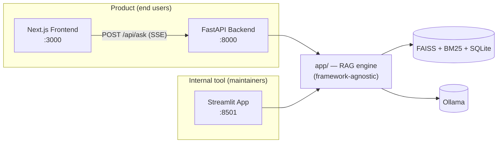

# Architecture

[← Back to README](../README.md)

## System overview

UzLaw AI has two independent surfaces sharing one Python core:

- **`app/`** is the framework-agnostic core: ingestion, chunking, hybrid
  retrieval, reranking, prompting, and the `RAGPipeline` that wires them
  together. Neither the API nor Streamlit duplicates this logic — both
  call into the same `RAGPipeline`.
- **`api/`** is a thin FastAPI layer over `app/` — one route
  (`POST /api/ask`) that streams Server-Sent Events, plus a health check.
  It is the *only* public contract the frontend depends on
  (`api/schemas.py`'s `SourceOut`), specifically so an internal refactor
  of `app/`'s pipeline objects can never silently break the frontend.
- **`frontend/`** is the end-user product: search box, streaming answer,
  citations, saved answers.
- **Streamlit (`app/ui/`)** stays as the internal/debug tool — index
  management, retrieval debug (full score breakdowns), and statistics —
  rather than being reimplemented in the product UI.

## Why `retrieve()` and `ask()` are separate

`RAGPipeline.retrieve()` runs every stage *except* the final LLM call
(preprocess → hybrid retrieve → rerank → compress) and returns a
`RetrievalContext` holding the output of *every* stage, not just the
final compressed chunks. `ask()`/`ask_stream()` call `retrieve()` and
then generate from it. This split exists because different callers need
different subsets of the work:

- The **Chat/product flow** wants a full streamed answer.
- The **Retrieval Debug page** wants to show *how* a query was retrieved
  and reranked — dense/sparse/reranker scores at every stage — without
  necessarily generating an answer.
- **Streaming** needs sources available immediately (so the frontend can
  render the sources panel right away) while the answer is still being
  generated — `ask_stream()` calls `retrieve()` first (fast, no LLM),
  then starts the slow part.

## Why an empty result short-circuits before the LLM

If retrieval finds nothing relevant, the pipeline returns the "not found"
message directly, without calling the LLM at all. The system prompt also
instructs the model to say this when its context doesn't answer the
question — but for the one case where there is *zero* context, a direct
code-level check is a stronger guarantee than trusting the model to
notice and comply, which matters for a "never fabricate a citation"
requirement.

## The API contract

`api/schemas.py`'s `SourceOut` is deliberately a separate model from
`app.reranker.RerankedResult` — the internal pipeline model can evolve
freely (it's shaped however the pipeline's stages naturally produce
data) without risking a silent break in the frontend, since
`SourceOut.from_reranked()` is the one explicit translation point.

See [`hybrid-retrieval.md`](hybrid-retrieval.md) for how a query actually
becomes a ranked set of chunks.
