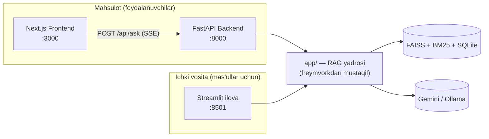

# Arxitektura

[← README'ga qaytish](../README.md)

## Tizimga umumiy nazar

UzLaw AI bitta umumiy Python yadrosiga tayanadigan ikkita mustaqil qatlamga ega:

- **`app/`** — freymvorkdan mustaqil yadro: hujjat yuklash, bo'laklash,
  hybrid qidiruv, qayta saralash, prompt tuzish va bularning barchasini
  bog'lovchi `RAGPipeline`. API ham, Streamlit ham bu mantiqni
  takrorlamaydi — ikkalasi ham bir xil `RAGPipeline`ga murojaat qiladi.
- **`api/`** — `app/` ustidagi yupqa FastAPI qatlami: Server-Sent Events
  orqali striming beruvchi bir nechta yo'nalish (`POST /api/ask`,
  `POST /api/analyze-document`, `GET /api/collections`) va health-check.
  Bu frontend bog'liq bo'lgan *yagona* ochiq shartnoma
  (`api/schemas.py`dagi `SourceOut`) — shu bois `app/`ning ichki
  pipeline obyektlarini refaktor qilish frontendni sezilmasdan
  buzib qo'ymaydi.
- **`frontend/`** — yakuniy foydalanuvchi mahsuloti: qidiruv oynasi,
  striming javob, iqtiboslar, hujjat yuklab tahlil qilish.
- **Streamlit (`app/ui/`)** — ichki/diagnostika vositasi bo'lib qoladi:
  indeks boshqaruvi, qidiruv diagnostikasi (to'liq ball taqsimoti) va
  statistika — mahsulot interfeysida qayta yozilmaydi.

## Nega `retrieve()` va `ask()` alohida

`RAGPipeline.retrieve()` LLM chaqiruvidan *tashqari* barcha bosqichlarni
(qayta ishlash → hybrid qidiruv → qayta saralash → siqish) bajaradi va
har bir bosqichning natijasini saqlovchi `RetrievalContext`ni qaytaradi
— faqat yakuniy siqilgan bo'laklarni emas. `ask()`/`ask_stream()` avval
`retrieve()`ni chaqiradi, keyin shundan javob generatsiya qiladi. Bu
bo'linish turli chaqiruvchilarga turli qismlar kerakligi sababli mavjud:

- **Chat/mahsulot oqimi** to'liq striming javob xohlaydi.
- **Qidiruv diagnostika sahifasi** so'rov qanday qidirilgan va qayta
  saralanganini — har bosqichdagi dense/sparse/reranker ballarini —
  ko'rsatishni xohlaydi, javob generatsiya qilmasdan ham.
- **Striming** manbalarni darhol talab qiladi (frontend manbalar
  panelini darhol chizishi uchun), javob hali generatsiya qilinayotgan
  paytda — `ask_stream()` avval `retrieve()`ni chaqiradi (tez, LLM
  ishtirokisiz), keyingina sekin qismni boshlaydi.

## Nega bo'sh natija LLM chaqirilishidan oldin to'xtaydi

Agar qidiruv hech narsa topmasa, pipeline "topilmadi" xabarini
to'g'ridan-to'g'ri qaytaradi, LLM umuman chaqirilmaydi. Tizim prompti
ham modelga kontekst savolga javob bermasa shunday deyishni buyuradi —
lekin kontekst *butunlay yo'q* bo'lgan yagona holat uchun kod darajasidagi
to'g'ridan-to'g'ri tekshiruv modelning buni payqab, rioya qilishiga
ishonishdan kuchliroq kafolat beradi — bu "hech qachon iqtibos o'ylab
topmaslik" talabi uchun muhim.

## API shartnomasi

`api/schemas.py`dagi `SourceOut` ataylab `app.reranker.RerankedResult`dan
alohida model — ichki pipeline modeli erkin rivojlanishi mumkin (u
pipeline bosqichlari tabiiy ravishda ishlab chiqargan shaklda bo'ladi),
frontendni sezilmasdan buzib qo'yish xavfisiz, chunki
`SourceOut.from_reranked()` yagona aniq tarjima nuqtasidir.

So'rov qanday qilib saralangan bo'laklar to'plamiga aylanishi haqida
qarang: [`hybrid-retrieval.md`](hybrid-retrieval.md).
