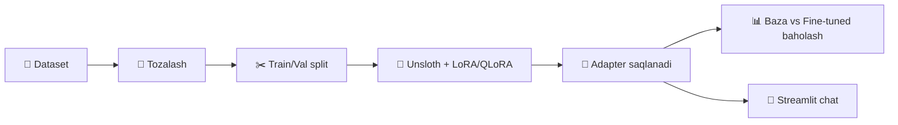
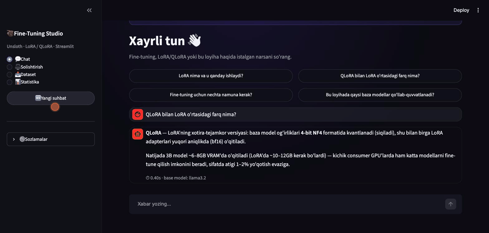
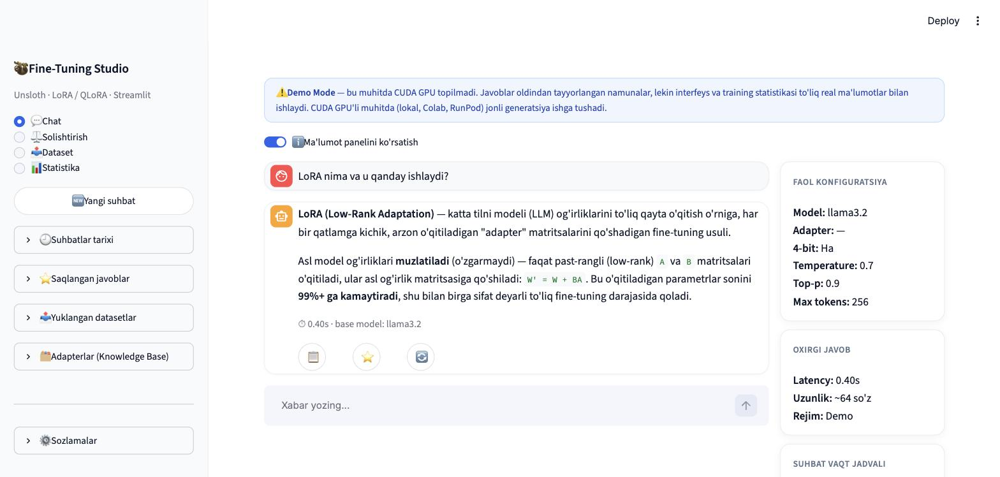
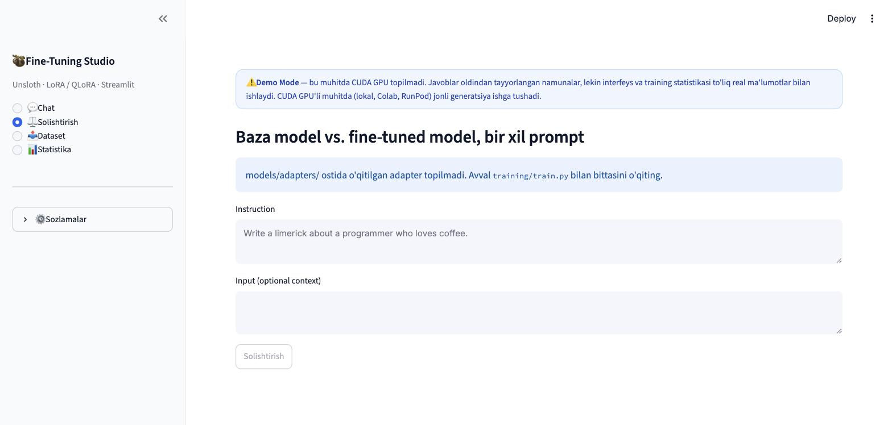
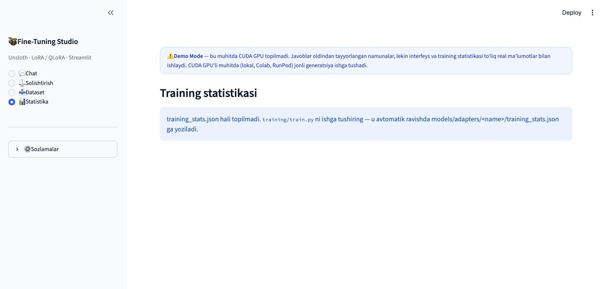

<div align="center">

# 🦥 Local LLM Fine-Tuning Studio

### Lokal LLM'larni LoRA/QLoRA bilan fine-tune qilish va sinash platformasi

*Unsloth · PEFT · Hugging Face Transformers · Streamlit*

<br>


<br>

[Loyiha haqida](#-loyiha-haqida) ·
[Qanday ishlaydi](#-qanday-ishlaydi) ·
[Texnologiyalar](#-texnologiyalar) ·
[Tez boshlash](#-tez-boshlash) ·
[Loyiha tuzilmasi](#-loyiha-tuzilmasi)

</div>

---

## 📌 Loyiha haqida

> **Fine-Tuning Studio** — kichik LLM'larni (Llama 3.2, Qwen 2.5) o'z ma'lumotlaringiz bilan **LoRA/QLoRA** usulida o'qitib, natijani asl model bilan solishtirib ko'rish uchun to'liq lokal platforma.

Bitta training skriptidan farqli o'laroq, bu loyiha butun tsiklni qamrab oladi: ma'lumotni tayyorlash → o'qitish → baholash → chat interfeys orqali sinash.

**Qayerda foydali:**
- Domenga xos chatbot yoki yordamchi yaratish (masalan, huquqiy, tibbiy, mijozlarga xizmat)
- Kichik GPU'da (8–16GB) katta modellarni arzon fine-tune qilish
- PEFT/LoRA'ni portfolio loyihasi sifatida namoyish qilish

---

## ⚙️ Qanday ishlaydi



| Qadam | Tavsif |
|:-----:|--------|
| **1** | Alpaca-format dataset tozalanadi va train/val'ga bo'linadi |
| **2** | Unsloth orqali baza model 4-bit yuklanadi, LoRA adapter qo'shiladi |
| **3** | Adapter (nafaqat butun model) `models/adapters/`ga saqlanadi |
| **4** | Fine-tuned model baza model bilan perplexity va sifat bo'yicha solishtiriladi |
| **5** | Streamlit ilova orqali ikkalasi ham real vaqtda sinaladi |

---

## 🎬 Demo

<div align="center">

</div>

> GPU'siz muhitda (masalan shu screenshot) ilova **Demo Mode**da ishlaydi — interfeys va training statistikasi to'liq ishlaydi, faqat jonli generatsiya o'rniga placeholder javob ko'rsatiladi.

<div align="center">

| Chat | Solishtirish | Statistika |
|---|---|---|
|  |  |  |

</div>

---

## 🧱 Texnologiyalar

<div align="center">


</div>

| Qatlam | Vosita |
|---|---|
| **Fine-tuning** | Unsloth (LoRA/QLoRA) + PEFT + Transformers |
| **Quantization** | bitsandbytes (4-bit NF4) |
| **Training loop** | Hugging Face TRL (`SFTTrainer`) |
| **Baza modellar** | Llama 3.2 3B, Qwen 2.5 7B (4-bit Unsloth checkpoint) |
| **Interfeys** | Streamlit + Plotly |
| **Test** | Pytest |

---

## 🚀 Tez boshlash

```bash
pip install -r requirements.txt

# Fine-tune qilish (CUDA GPU kerak)
python training/train.py --mode qlora --model llama3.2

# Baza vs fine-tuned solishtirish
python evaluation/evaluate.py --adapter llama3.2-qlora

# Interfeysni ishga tushirish
streamlit run app/streamlit_app.py
```

GPU yo'qmi? [`notebooks/colab_finetune.ipynb`](notebooks/colab_finetune.ipynb) orqali bepul Colab T4'da to'liq pipeline'ni ishga tushiring. To'liq qo'llanma: [docs/](docs/).

---

## 📁 Loyiha tuzilmasi

```
local-llm-finetune-unsloth/
├── app/            # Streamlit interfeys (chat, solishtirish, statistika)
├── configs/        # LoRA/QLoRA hyperparametrlari (YAML)
├── scripts/        # Dataset konvert/tozalash/bo'lish
├── training/        # Unsloth + TRL training entrypoint
├── inference/        # CLI orqali generatsiya
├── evaluation/       # Baza vs fine-tuned baholash
├── tests/             # Pytest suite
└── notebooks/          # Colab uchun tayyor notebook
```

---

## 📄 Litsenziya

MIT

